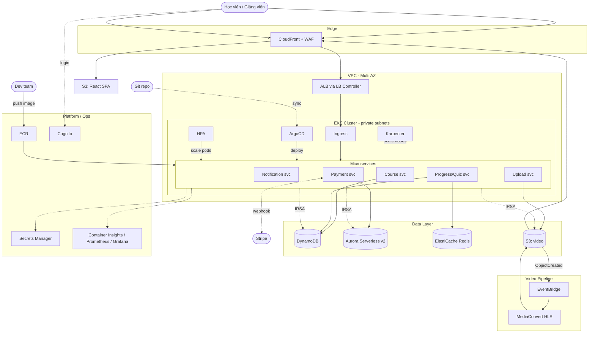

# 02 — Kiến trúc giải pháp (EKS)

## Sơ đồ kiến trúc

## Các luồng chính (để present cho khách)

### 1. Truy cập web
Học viên → CloudFront (+ WAF chống tấn công) → React SPA trên S3. API đi qua CloudFront → ALB → Ingress → microservice trong EKS.

### 2. Xác thực
Đăng nhập qua **Cognito** (email hoặc Google/Facebook). Token JWT được service verify.

### 3. Deploy (GitOps)
Dev push code → CI build image → đẩy **ECR** (scan bảo mật) → cập nhật Helm chart trong Git → **ArgoCD** tự đồng bộ vào cluster. Trạng thái hệ thống = trạng thái trong Git (tái lập được, rollback dễ).

### 4. Video pipeline
Giảng viên upload → **S3** → sự kiện `ObjectCreated` → **EventBridge** → **MediaConvert** transcode ra HLS nhiều độ phân giải → lưu lại S3 → phát qua **CloudFront + signed URL** (chống tải lậu).

### 5. Thanh toán
Mua khóa học → **Stripe** xử lý (không tự lưu thẻ → giảm rủi ro PCI) → webhook về Payment service → ghi đơn vào **Aurora Serverless v2**.

### 6. Autoscaling (2 tầng)
Tải tăng → **HPA** thêm pod → **Karpenter** thêm node phù hợp → tải giảm thì thu về → tối ưu chi phí.

## Bảo mật
- **IRSA:** mỗi microservice có ServiceAccount gắn IAM Role least-privilege (pod truy cập DynamoDB/S3 không cần access key).
- **Secrets Manager + CSI driver:** secret mount vào pod, không hardcode.
- **Network:** node ở private subnet, chỉ ALB ở public; network policy giới hạn traffic pod-to-pod.
- **Mã hóa:** S3/EBS/RDS at-rest (KMS), TLS in-transit.

## Multi-AZ & DR
- EKS node group trải trên ≥2 AZ.
- Aurora multi-AZ, DynamoDB tự replicate, S3 durability 11 số 9.
- Backup: Aurora snapshot tự động, S3 versioning.
