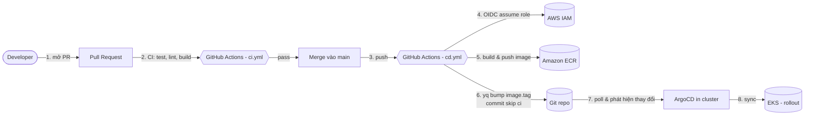

# 06 — CI/CD (GitOps)

Mô hình **tách CI khỏi CD**: GitHub Actions lo *build & test & push image + bump tag*, ArgoCD lo *deploy*.
Đây là pattern chuẩn của dự án EKS thật.

## Sơ đồ luồng



## Hai workflow

### `ci.yml` — trên Pull Request
| Job | Việc |
|---|---|
| `service` | `npm ci` → syntax check → smoke test (health + CRUD) → `docker build` |
| `helm` | `helm lint` chart |
| `terraform` | `fmt -check` → `init -backend=false` → `validate` |

Không có gì được deploy — chỉ chặn merge nếu fail.

### `cd.yml` — khi merge vào main (đổi service/chart)
1. **OIDC** assume IAM role `*-gha-ecr-push` (không dùng access key tĩnh).
2. Login ECR, `docker buildx` build & push tag `sha-<7>` + `latest`.
3. `yq` cập nhật `image.repository` + `image.tag` trong `charts/course-service/values.yaml`.
4. Commit bump kèm `[skip ci]` rồi push (không tạo vòng lặp workflow).
5. **ArgoCD** (trong cluster) phát hiện thay đổi Git → tự sync → rollout.

> Tại sao không `kubectl apply` trực tiếp trong CD? Vì GitOps: **trạng thái mong muốn = Git**. ArgoCD đảm bảo cluster luôn khớp Git, dễ audit & rollback (chỉ cần revert commit).

## Thiết lập một lần

### 1. Tạo IAM/OIDC bằng Terraform
`infra/github-oidc.tf` tạo OIDC provider + role. Sau `terraform apply`:
```bash
terraform output -raw github_actions_role_arn
```

### 2. Khai báo biến cho GitHub Actions
```bash
gh variable set AWS_REGION        --body "ap-southeast-1"
gh variable set AWS_ROLE_ARN      --body "$(terraform -chdir=infra output -raw github_actions_role_arn)"
gh variable set AWS_PLAN_ROLE_ARN --body "$(terraform -chdir=infra output -raw github_actions_plan_role_arn)"
```
> Dùng **repository variables** (không phải secret) vì ARN/region không nhạy cảm.
> `GITHUB_TOKEN` tự có sẵn — không cần tạo.

## Workflow bổ sung

| Workflow / file | Trigger | Việc |
|---|---|---|
| `terraform-plan.yml` | **Mọi PR** (tự phát hiện `infra/**`) | Nếu đụng infra: assume role read-only (OIDC) → `terraform plan` → comment sticky vào PR. Nếu không: skip nhưng vẫn báo **check pass** → an toàn để đưa vào required. |
| `security.yml` | PR / push / lịch tuần | `npm audit` (high) · **Trivy** (deps + secrets) · **Checkov** (IaC Terraform) |
| `dependabot.yml` | Lịch tuần | Tự mở PR update npm / github-actions / terraform / docker |

> `terraform plan` dùng role riêng `*-gha-tf-plan` (ReadOnlyAccess) — tách quyền khỏi role push ECR (least-privilege).
> Muốn plan chính xác trên state thật: bật remote state (xem `infra/backend.tf.example`).

## Branch protection (Repository Ruleset)

Ruleset `protect-main` siết nhánh `main`:
- **Bắt buộc PR** (không push thẳng), branch phải up-to-date trước khi merge.
- **Required status checks** phải pass mới merge được:
  - `Course service — build & test`
  - `Helm chart — lint`
  - `Terraform — fmt & validate`
  - `Plan & comment` (required-safe: luôn chạy, tự skip nếu PR không đụng infra)
- Chặn xóa nhánh & force-push.

> Security scan (`npm audit`, Trivy, Checkov) **vẫn chạy** trên mỗi PR nhưng để *informational*
> (không chặn merge). Khi codebase sạch, có thể "ratchet up" bằng cách thêm chúng vào required checks.

### 3. Cài ArgoCD Application
```bash
kubectl apply -f gitops/apps/course-service.yaml
```

## Bảo mật
- Không có access key AWS tĩnh trong repo/CI — chỉ OIDC token ngắn hạn.
- Role bị siết chỉ cho `repo:leloc70/eduvn-elearning-eks:ref:refs/heads/main` assume.
- Quyền IAM tối thiểu: chỉ push/pull ECR.
- Commit bump dùng `[skip ci]` + push bằng `GITHUB_TOKEN` → không lặp workflow.
